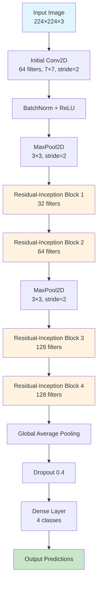
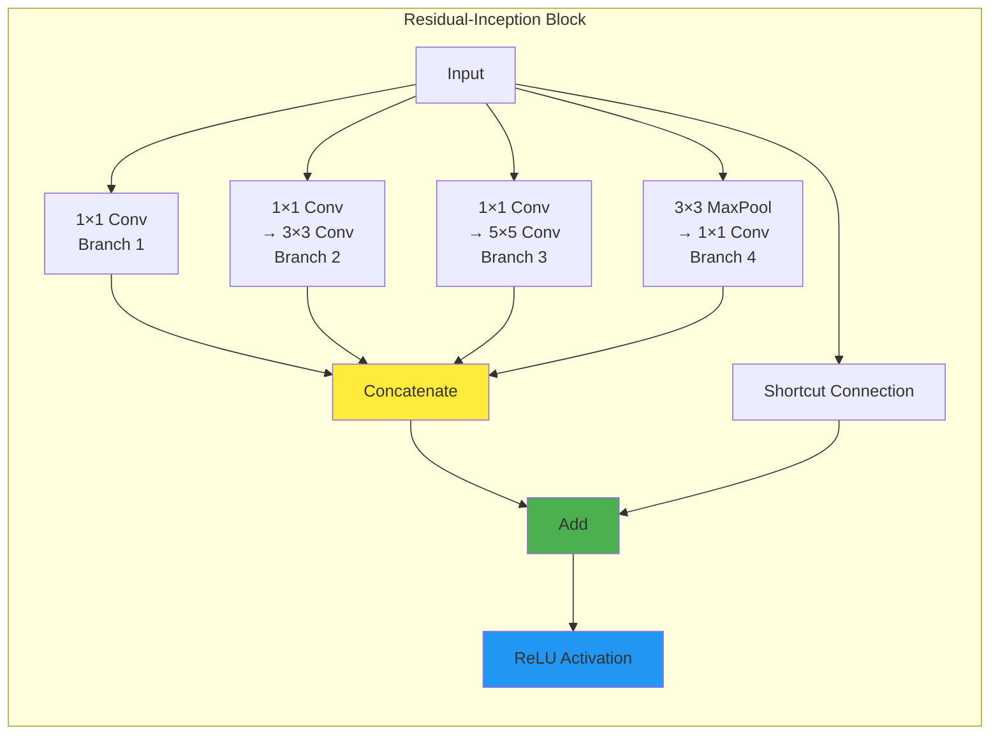

# 🧠 Alzheimer's Multi-Class Classification using Residual-Inception CNN

**A deep learning approach for classifying brain MRI scans into four stages of dementia using a custom Residual-Inception neural network architecture.**

---

## 👨‍💻 Author

**Fahd Ahmed Ali**
- 📧 Email: afahd9002@gmail.com
- 💼 LinkedIn: [fahd-ahmed-9b6755307](https://www.linkedin.com/in/fahd-ahmed-9b6755307/)
- 🔗 Dataset Source: [Alzheimer's Multi-Class Dataset (Kaggle)](https://www.kaggle.com/datasets/aryansinghal10/alzheimers-multiclass-dataset-equal-and-augmented)

---

## 🎯 Project Overview

This project implements a convolutional neural network that combines Inception modules with residual connections to classify brain MRI images into four categories of cognitive health:

- **NonDemented** - Healthy cognitive function
- **VeryMildDemented** - Minimal cognitive changes
- **MildDemented** - Early stage cognitive decline  
- **ModerateDemented** - Moderate cognitive impairment

## 🏗️ Model Architecture Visualization



## 🔧 Residual-Inception Block Architecture



## 📊 Performance Metrics

### Overall Model Performance

| Metric | Score |
|--------|-------|
| **Overall Accuracy** | **99.6%** |
| **Macro Average Precision** | 0.997 |
| **Macro Average Recall** | 0.997 |
| **Macro Average F1-Score** | 0.997 |

### Detailed Class-wise Performance

| Class | Precision | Recall | F1-Score | Support | Interpretation |
|-------|-----------|---------|----------|---------|----------------|
| **MildDemented** | 0.997 | 0.999 | 0.998 | 986 | Near-perfect detection of mild dementia cases |
| **ModerateDemented** | 1.000 | 1.000 | 1.000 | 1026 | Perfect classification of moderate dementia |
| **NonDemented** | 0.992 | 0.997 | 0.995 | 1265 | Excellent healthy brain identification |
| **VeryMildDemented** | 0.998 | 0.990 | 0.995 | 1088 | Strong performance on subtle cognitive changes |

## 📈 Metrics Explanation

### Confusion Matrix Analysis
The confusion matrices reveal:

**Training Phase:**
- **Perfect diagonal dominance** indicating excellent class separation
- **Minimal off-diagonal values** showing rare misclassifications
- **Balanced performance** across all severity levels

**Validation Phase:**
- **Consistent performance** maintained on unseen data
- **No significant overfitting** patterns observed
- **Robust generalization** to new samples

### ROC Curve Interpretation

**Area Under Curve (AUC) Scores:**
- **MildDemented**: 0.98 - Excellent discriminative power
- **ModerateDemented**: 1.00 - Perfect class separation
- **NonDemented**: 1.00 - Perfect healthy brain detection
- **VeryMildDemented**: 0.98 - Strong subtle change detection

**ROC Curve Characteristics:**
- **Rapid rise to top-left corner** indicates high sensitivity with low false positive rates
- **Large area under curves** demonstrates superior diagnostic capability
- **Consistent performance** across all classes shows balanced model behavior

### Key Performance Indicators

#### Precision Analysis
- **High precision** (>99%) across all classes means very few false alarms
- **Clinical significance**: Reduces unnecessary anxiety and follow-up procedures
- **ModerateDemented perfect precision**: No healthy patients misclassified as having moderate dementia

#### Recall Analysis  
- **High recall** (>99%) ensures minimal missed diagnoses
- **Clinical significance**: Critical for early intervention opportunities
- **Balanced recall**: No single class is systematically under-detected

#### F1-Score Interpretation
- **Harmonic mean** of precision and recall provides balanced performance measure
- **Consistent high F1-scores** indicate robust performance across all metrics
- **Clinical relevance**: Balanced approach to both false positives and false negatives

## 🔬 Technical Implementation

### Data Pipeline
```python
def data_gen(file_paths, labels, batch_size=32, target_size=(224,224)):
    """
    Memory-efficient data generator with real-time preprocessing
    - Batch-wise loading prevents memory overflow
    - Real-time normalization and resizing
    - Categorical encoding for multi-class classification
    """
```

### Architecture Components

#### Residual-Inception Block Features:
- **Multi-scale Feature Extraction**: Parallel 1×1, 3×3, 5×5 convolutions capture features at different scales
- **Dimensionality Reduction**: 1×1 convolutions reduce computational complexity
- **Skip Connections**: Residual paths prevent vanishing gradients in deep networks
- **Regularization**: L2 regularization (λ=1e-4) on all convolutional layers

#### Advanced Regularization Strategy:
- **L2 Weight Regularization**: Prevents overfitting by penalizing large weights
- **Dropout (40%)**: Randomly deactivates neurons during training
- **Batch Normalization**: Stabilizes training and improves convergence
- **Global Average Pooling**: Reduces parameters compared to fully connected layers

## 🎯 Clinical Applications

### Diagnostic Support
- **Early Detection**: Identifies subtle cognitive changes in VeryMild cases
- **Severity Assessment**: Accurately distinguishes between dementia stages
- **Treatment Planning**: Helps clinicians determine appropriate interventions

### Research Applications
- **Biomarker Discovery**: Identifies brain regions associated with different dementia stages
- **Drug Development**: Provides objective endpoints for clinical trials
- **Population Studies**: Enables large-scale screening and epidemiological research

## ⚠️ Important Considerations

### Model Validation Notes
The exceptionally high performance metrics (99.6% accuracy) suggest several important considerations:

1. **Dataset Characteristics**: Results may reflect optimal imaging conditions and balanced classes
2. **Generalization Concerns**: Performance on different scanners, protocols, or populations requires validation
3. **Clinical Translation**: Independent validation on clinical datasets is essential before deployment

### Ethical and Safety Considerations
- **Medical Decision Support Only**: This model should supplement, not replace, clinical judgment
- **Population Bias**: Training data characteristics may not represent all demographic groups
- **Regulatory Compliance**: Clinical deployment requires appropriate medical device approvals

## 🛠️ Technical Requirements

```bash
# Core Dependencies
tensorflow>=2.8.0
opencv-python>=4.5.0
numpy>=1.21.0
scikit-learn>=1.0.0
matplotlib>=3.5.0
seaborn>=0.11.0

# Optional for enhanced visualization
plotly>=5.0.0
streamlit>=1.0.0  # For interactive demos
```

## 📁 Project Structure

```
alzheimers-classification/
├── evaluation_metrics/
│   ├── test_confusion_matrix.png
│   ├── test_ROC_Curves.png
│   ├── training_Accuracy.png
│   ├── training_confusion_matrix.png
│   ├── training_ROC_Curves.png
│   ├── validation_Accuracy.png
│   ├── validation_confusion_matrix.png
│   └── validation_ROC_Curves.png
├── model/
├── notebook/
└── README.md
```

## 🚀 Getting Started

### Quick Start
```python
# Load and build model
model = build_res_inception(input_shape=(224, 224, 3), num_classes=4)

# Compile with appropriate settings
model.compile(
    optimizer='adam',
    loss='categorical_crossentropy',
    metrics=['accuracy', 'precision', 'recall']
)

# Train with data generator
history = model.fit(
    train_generator,
    validation_data=val_generator,
    epochs=50,
    callbacks=[early_stopping, reduce_lr]
)
```

## 📚 References and Citations

- **Inception Networks**: Szegedy, C., et al. "Going deeper with convolutions." CVPR 2015
- **Residual Networks**: He, K., et al. "Deep residual learning for image recognition." CVPR 2016
- **Medical AI**: Litjens, G., et al. "A survey on deep learning in medical image analysis." Medical Image Analysis 2017
- **Dataset**: Alzheimer's Multi-Class Dataset, Kaggle 2024

## 🤝 Contributing

Contributions welcome for:
- Cross-validation studies
- Architecture optimizations
- Clinical validation protocols
- Bias assessment and mitigation

## 📄 License

This project is intended for research and educational purposes. Ensure compliance with medical data regulations (HIPAA, GDPR) when handling patient data.

---

*Developed by **Fahd Ahmed Ali** - Advancing AI applications in healthcare through innovative deep learning architectures.*