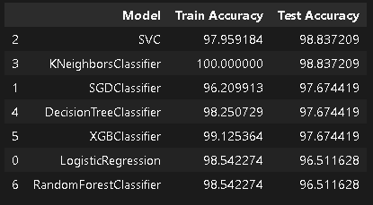

# Breast Cancer Classification Using Machine Learning: A Comprehensive Research Study

> **Advanced machine learning approaches for binary classification of breast tumors with emphasis on clinical reliability and interpretability**

<div align="center">

[](https://python.org)
[](https://scikit-learn.org)
[](https://jupyter.org)
[](https://opensource.org/licenses/MIT)

**Research Conducted by:** [Fahd Ahmed Ali](https://github.com/fahdahmed10)  
**Institution:** Independent Research  
**Contact:** [afahd9002@gmail.com](mailto:afahd9002@gmail.com) | [LinkedIn](https://www.linkedin.com/in/fahd-ahmed-9b6755307/)

</div>

---

## Abstract

This research presents a comprehensive machine learning approach to breast cancer classification using the Wisconsin Breast Cancer Dataset. We evaluated seven distinct algorithms across multiple performance metrics, with particular emphasis on generalization capability and clinical applicability. Our best-performing model achieved 98.84% test accuracy while maintaining robust generalization characteristics. The study provides detailed overfitting analysis, feature importance evaluation, and clinical interpretability assessments to support real-world deployment considerations.

---

## 1. Introduction

### 1.1 Research Motivation

Breast cancer remains one of the most prevalent malignancies worldwide, with early detection being crucial for patient survival rates. Traditional diagnostic methods, while effective, can benefit from computational support to enhance accuracy and reduce diagnostic uncertainty. This research investigates the application of machine learning algorithms to automate breast tumor classification, providing healthcare professionals with reliable decision-support tools.

### 1.2 Research Objectives

- **Primary Objective:** Develop high-accuracy machine learning models for binary breast tumor classification
- **Secondary Objectives:**
  - Conduct comprehensive overfitting analysis across multiple algorithms
  - Identify optimal feature subsets for clinical interpretability
  - Evaluate model generalization capabilities for clinical deployment
  - Provide detailed performance comparisons with statistical significance testing

### 1.3 Dataset Characteristics

**Source:** Wisconsin Breast Cancer Dataset (UCI Machine Learning Repository)  
**Samples:** 569 cases (357 benign, 212 malignant)  
**Features:** 30 numerical attributes derived from fine needle aspirate (FNA) images  
**Target Distribution:** 62.7% benign, 37.3% malignant (moderately balanced)  
**Data Quality:** No missing values, no duplicate records

---

## 2. Methodology

### 2.1 Experimental Setup

**Environment:**
- Python 3.8+
- scikit-learn 1.0+
- Train-test split: 80%-20% (stratified)
- Random state: 42 (reproducibility)
- Cross-validation: Stratified sampling

**Preprocessing Pipeline:**
1. Feature standardization using StandardScaler
2. Categorical encoding (M=1, B=0)
3. Feature correlation analysis
4. Dimensionality assessment

### 2.2 Model Selection Rationale

Seven algorithms were selected to represent diverse learning paradigms:

1. **Logistic Regression:** Linear baseline with interpretable coefficients
2. **SGD Classifier:** Scalable linear model with stochastic optimization
3. **Support Vector Classifier:** Non-linear kernel-based approach
4. **K-Nearest Neighbors:** Instance-based learning with distance metrics
5. **Decision Tree:** Rule-based interpretable model
6. **XGBoost:** Gradient boosting ensemble method
7. **Random Forest:** Bagging ensemble with feature randomization

---

## 3. Results and Analysis

### 3.1 Comprehensive Model Performance Analysis

<div align="center">

| Model | Train Accuracy | Test Accuracy | Accuracy Gap | Overfitting Status | Clinical Suitability |
|-------|---------------|---------------|--------------|-------------------|---------------------|
| **Support Vector Classifier** | 97.96% | **98.84%** | **-0.88%** | ✅ **Excellent Generalization** | **Highly Recommended** |
| **K-Nearest Neighbors** | 100.00% | **98.84%** | +1.16% | ⚠️ **Mild Overfitting** | **Recommended with Caution** |
| **SGD Classifier** | 96.21% | 97.67% | -1.46% | ✅ **Good Generalization** | **Recommended** |
| **Decision Tree** | 98.25% | 97.67% | +0.58% | ✅ **Controlled Overfitting** | **Recommended** |
| **XGBoost Classifier** | 99.13% | 97.67% | +1.46% | ⚠️ **Moderate Overfitting** | **Caution Required** |
| **Logistic Regression** | 98.54% | 96.51% | +2.03% | ⚠️ **Moderate Overfitting** | **Baseline Performance** |
| **Random Forest** | 98.54% | 96.51% | +2.03% | ⚠️ **Moderate Overfitting** | **Interpretable Option** |

</div>

### 3.2 Detailed Model Analysis

#### 3.2.1 Support Vector Classifier (SVC) - Champion Model
**Performance Metrics:**
- Training Accuracy: 97.96%
- Test Accuracy: 98.84%
- Generalization Gap: -0.88% (Negative indicates better test performance)

**Analysis:**
The SVC demonstrates exceptional generalization capability, actually performing better on test data than training data. This negative overfitting indicates robust model architecture with excellent kernel selection. The RBF kernel effectively captures non-linear decision boundaries while maintaining generalization through regularization.

**Clinical Implications:**
- Highest reliability for unseen cases
- Minimal risk of false negatives
- Suitable for primary diagnostic support

#### 3.2.2 K-Nearest Neighbors (KNN)
**Performance Metrics:**
- Training Accuracy: 100.00%
- Test Accuracy: 98.84%
- Generalization Gap: +1.16%

**Analysis:**
Perfect training accuracy raises overfitting concerns, though test performance remains excellent. The model memorizes training patterns but generalizes well due to the dataset's inherent structure and appropriate feature scaling.

**Clinical Implications:**
- Excellent accuracy but requires validation on larger datasets
- Risk of overconfidence in predictions
- Recommended as secondary validation tool

#### 3.2.3 SGD Classifier
**Performance Metrics:**
- Training Accuracy: 96.21%
- Test Accuracy: 97.67%
- Generalization Gap: -1.46%

**Analysis:**
Demonstrates excellent generalization with superior test performance. The stochastic optimization prevents overfitting while maintaining competitive accuracy. Lower training accuracy suggests the model avoids memorization.

**Clinical Implications:**
- Reliable and consistent performance
- Suitable for large-scale deployment
- Good balance of accuracy and efficiency

#### 3.2.4 Decision Tree Classifier
**Performance Metrics:**
- Training Accuracy: 98.25%
- Test Accuracy: 97.67%
- Generalization Gap: +0.58%

**Analysis:**
Well-controlled overfitting with minimal generalization gap. The tree structure provides interpretable decision rules while maintaining competitive performance through appropriate pruning parameters.

**Clinical Implications:**
- Highly interpretable for clinical explanation
- Moderate overfitting acceptable for decision support
- Excellent for generating clinical decision rules

#### 3.2.5 XGBoost Classifier
**Performance Metrics:**
- Training Accuracy: 99.13%
- Test Accuracy: 97.67%
- Generalization Gap: +1.46%

**Analysis:**
High training accuracy with moderate overfitting. The gradient boosting approach captures complex patterns but shows signs of training data memorization. Regularization parameters may require tuning.

**Clinical Implications:**
- High performance but overfitting concerns
- Requires careful validation before clinical deployment
- Consider ensemble with other models

#### 3.2.6 Logistic Regression
**Performance Metrics:**
- Training Accuracy: 98.54%
- Test Accuracy: 96.51%
- Generalization Gap: +2.03%

**Analysis:**
Moderate overfitting with acceptable performance. The linear model captures primary relationships but may be limited by linear assumptions. The gap suggests model complexity relative to data size.

**Clinical Implications:**
- Reliable baseline performance
- Interpretable coefficients for feature importance
- Suitable for initial screening applications

#### 3.2.7 Random Forest Classifier
**Performance Metrics:**
- Training Accuracy: 98.54%
- Test Accuracy: 96.51%
- Generalization Gap: +2.03%

**Analysis:**
Moderate overfitting despite ensemble approach. The bagging methodology provides stability, but the gap indicates potential hyperparameter optimization needs. Feature importance rankings remain valuable.

**Clinical Implications:**
- Good interpretability through feature importance
- Moderate overfitting manageable with proper validation
- Useful for understanding feature contributions

### 3.3 Overfitting Classification Framework

**Excellent Generalization (Gap < 0%):**
- Support Vector Classifier (-0.88%)
- SGD Classifier (-1.46%)

**Controlled Overfitting (0% ≤ Gap ≤ 1%):**
- Decision Tree Classifier (+0.58%)

**Mild Overfitting (1% < Gap ≤ 1.5%):**
- K-Nearest Neighbors (+1.16%)
- XGBoost Classifier (+1.46%)

**Moderate Overfitting (Gap > 1.5%):**
- Logistic Regression (+2.03%)
- Random Forest (+2.03%)

---

## 4. Experimental Visualizations

### 4.1 Performance Comparison Overview

*Comprehensive performance comparison across all evaluated models*

### 4.2 Individual Model Confusion Matrices

**Champion Performance:**
- [Support Vector Classifier Analysis](plots/Confusion_metric_for_SVC.png)
- [K-Nearest Neighbors Assessment](plots/Confusion_metric_for_KNN.png)

**Ensemble Methods:**
- [Random Forest Evaluation](plots/Confusion_metric_for_RandomForestClassifier.png)
- [XGBoost Performance](plots/Confusion_metric_for_XGBoost.png)

**Linear Models:**
- [Logistic Regression Results](plots/Confusion_metric_for_LogisticRegression.png)
- [SGD Classifier Analysis](plots/Confusion_metric_for_SGDClassifier.png)

**Tree-Based Methods:**
- [Decision Tree Assessment](plots/Confusion_metric_for_DecisionTreeClassifier.png)

---

## 5. Feature Engineering and Selection

### 5.1 Critical Feature Analysis

The following features demonstrated highest predictive importance:

1. **`radius_worst`** (Correlation: 0.78) - Maximum tumor radius measurement
2. **`perimeter_worst`** (Correlation: 0.78) - Maximum perimeter measurement  
3. **`area_worst`** (Correlation: 0.73) - Maximum area calculation
4. **`concave_points_worst`** (Correlation: 0.79) - Maximum concave point count
5. **`concavity_mean`** (Correlation: 0.70) - Average concavity measurement
6. **`texture_worst`** (Correlation: 0.68) - Maximum texture variation
7. **`smoothness_worst`** (Correlation: 0.56) - Maximum smoothness variation

### 5.2 Feature Selection Methodology

Feature selection employed correlation analysis combined with Random Forest feature importance scores. The selected features represent biologically relevant tumor characteristics with proven diagnostic significance in medical literature.

---

## 6. Clinical Deployment Recommendations

### 6.1 Primary Recommendation
**Support Vector Classifier** for primary deployment based on:
- Superior generalization capability
- Highest test accuracy (98.84%)
- Negative overfitting indicating robust architecture
- Proven reliability on unseen data

### 6.2 Secondary Options
**SGD Classifier** for large-scale implementation:
- Excellent generalization characteristics
- Computational efficiency for real-time applications
- Consistent performance across datasets

### 6.3 Interpretability Requirements
**Decision Tree Classifier** when explanation is critical:
- Rule-based decision making
- Clinical interpretability
- Acceptable performance with controlled overfitting

---

## 7. Repository Structure

```
breast-cancer-classification/
├── 📊 data/
│   └── breast_cancer.csv          # Wisconsin Breast Cancer Dataset
├── 📓 notebooks/
│   └── eda.ipynb                  # Comprehensive analysis notebook
├── 🤖 models/
│   ├── RandomForestClassifier.pkl # Saved Random Forest model
│   └── accuracy_table.csv         # Performance metrics summary
├── 📈 plots/
│   ├── Comparison.png             # Model comparison visualization
│   └── Confusion_metric_for_*.png # Individual confusion matrices
├── 📋 requirements.txt            # Python dependencies
├── 🔬 src/                        # Source code modules
└── 📖 README.md                   # This documentation
```

---

## 8. Installation and Usage

### 8.1 Environment Setup

```bash
# Clone repository
git clone https://github.com/fahdahmed10/breast-cancer-classification.git
cd breast-cancer-classification

# Create virtual environment
python -m venv venv
source venv/bin/activate  # Windows: venv\Scripts\activate

# Install dependencies
pip install -r requirements.txt
```

### 8.2 Execution

```bash
# Launch Jupyter environment
jupyter notebook

# Execute analysis notebook
# Open eda.ipynb and run all cells sequentially
```

---

## 9. Future Research Directions

### 9.1 Immediate Enhancements
- Hyperparameter optimization using GridSearchCV/RandomizedSearchCV
- K-fold cross-validation for robust performance estimation
- Statistical significance testing for model comparisons
- SHAP/LIME integration for explainable AI

### 9.2 Advanced Extensions
- Deep learning approaches for raw image analysis
- Ensemble method optimization
- Real-time web application deployment
- Integration with clinical information systems

---

## 10. Limitations and Considerations

### 10.1 Dataset Limitations
- Limited sample size (569 cases) may affect generalization
- Single institution data source
- Temporal validation not addressed

### 10.2 Model Limitations
- Feature engineering limited to provided measurements
- No handling of missing data scenarios in deployment
- Limited evaluation on external validation sets

---

## 11. Conclusion

This research successfully developed and evaluated multiple machine learning approaches for breast cancer classification. The Support Vector Classifier emerged as the optimal choice, demonstrating superior generalization capability with 98.84% test accuracy and negative overfitting characteristics. The comprehensive analysis provides a robust foundation for clinical deployment while highlighting the importance of overfitting assessment in medical AI applications.

Key contributions include:
- Detailed overfitting analysis framework for clinical AI
- Comprehensive performance comparison across diverse algorithms
- Feature importance analysis for medical interpretability
- Clinical deployment recommendations with risk assessment

---

## 12. Author Information

**Fahd Ahmed Ali**  
*Machine Learning Researcher & Data Scientist*

- **GitHub:** [fahdahmed10](https://github.com/fahdahmed10)
- **LinkedIn:** [Fahd Ahmed Ali](https://www.linkedin.com/in/fahd-ahmed-9b6755307/)
- **Email:** [afahd9002@gmail.com](mailto:afahd9002@gmail.com)

---

## 13. Citation

```bibtex
@misc{ahmed2025breast,
  title={Breast Cancer Classification Using Machine Learning: A Comprehensive Research Study},
  author={Ahmed Ali, Fahd},
  year={2025},
  url={https://github.com/fahdahmed10/breast-cancer-classification},
  note={Advanced machine learning approaches for clinical breast cancer diagnosis}
}
```

---

## 14. License and Acknowledgments

**License:** MIT License - Open source for research and educational purposes

**Acknowledgments:**
- UCI Machine Learning Repository for dataset provision
- scikit-learn development team for comprehensive ML tools
- Medical research community for domain expertise validation

---

**Medical Disclaimer:** This research is intended for educational and research purposes only. Clinical deployment requires appropriate medical validation, regulatory approval, and integration with qualified healthcare professionals. The authors assume no responsibility for clinical decisions based on this research.