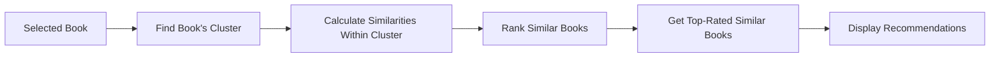

# 📚 AI-Powered Book Recommender System

<div align="center">


*Discover your next favorite book with the power of unsupervised machine learning*

[Demo](#demo) • [Features](#features) • [Installation](#installation) • [Usage](#usage) • [Contributing](#contributing)

</div>

---

## 🎯 Overview

In today's fast-paced world, finding the perfect book can be overwhelming with millions of options available. Our **AI-Powered Book Recommender System** uses **unsupervised nearest neighbor clustering** to implement collaborative filtering, grouping books with similar characteristics and recommending titles that readers with similar preferences have loved.

> **Why Unsupervised Clustering for Book Recommendations?** It automatically discovers hidden patterns in reading preferences, creating natural clusters of similar books based on user rating behaviors without requiring predefined categories!

## ✨ Features

- 🤖 **Unsupervised Clustering** - Uses nearest neighbor clustering to group similar books
- 📏 **Distance-Based Matching** - Precise similarity calculations between books
- 🎨 **Beautiful UI** - Clean, modern Streamlit interface
- ⚡ **Real-time Clustering** - Instant book similarity detection and recommendations
- 👥 **Community-Driven** - Leverages collective user preferences and ratings
- 🎯 **Automatic Pattern Discovery** - No manual categorization needed

## 🧠 How It Works

### Collaborative Filtering with Unsupervised Clustering

Our system uses **Collaborative Filtering** implemented through **unsupervised nearest neighbor clustering** - a powerful approach that automatically groups books with similar rating patterns and characteristics.

> *"Find books that are clustered as similar to your selection based on how users have rated them, then recommend the most similar books from the same cluster."*

| Step | Process | Description |
|------|---------|-------------|
| **1** | 📊 **Create Book-Rating Matrix** | Build matrix of books × users with ratings |
| **2** | 📏 **Calculate Book Distances** | Use distance metrics to measure book similarity |
| **3** | 👥 **Form Book Clusters** | Group books with similar rating patterns |
| **4** | 📚 **Generate Recommendations** | Suggest highly similar books from the same cluster |

### Unsupervised Clustering Algorithm Flow



### Why Unsupervised Clustering for Book Recommendations?

- **🎯 Pattern Discovery** - Automatically finds hidden relationships between books
- **📏 Distance-Based** - Uses advanced distance metrics for precise similarity measurement  
- **⚡ Efficient** - Fast computation for real-time recommendations
- **🔄 Adaptive** - Discovers new patterns as more books and ratings are added

## 🚀 Quick Start

### Prerequisites

- Python 3.7+
- pip package manager
- Git

### Installation

1. **Clone the repository**
   ```bash
   git clone https://github.com/your-username/Books-Recommender-System-Using-Machine-Learning.git
   cd Books-Recommender-System-Using-Machine-Learning
   ```

2. **Create virtual environment**
   ```bash
   # Using conda
   conda create -n book-recommender python=3.7.10 -y
   conda activate book-recommender
   
   # Or using venv
   python -m venv book-recommender
   source book-recommender/bin/activate  # On Windows: book-recommender\Scripts\activate
   ```

3. **Install dependencies**
   ```bash
   pip install -r requirements.txt
   ```

4. **Generate ML models**
   ```bash
   jupyter notebook "Books Recommender.ipynb"
   ```

5. **Launch the application**
   ```bash
   streamlit run app.py
   ```

## 📱 Demo

### 🖥️ Book Selection Interface
<div align="center">
  
  <p><em>Clean dropdown interface to search and select books from the database</em></p>
</div>

### 📚 AI-Powered Recommendations
<div align="center">
  
  <p><em>Get personalized recommendations with book covers and detailed information based on unsupervised clustering analysis</em></p>
</div>

## 💻 Usage

1. Open your browser and navigate to `http://localhost:8501`
2. **Select a book** from the dropdown menu that you've enjoyed
3. Click **"Show Recommendation"** button
4. Get instant recommendations based on books clustered as similar to your selection
5. Explore book covers and details of recommended books

## 📁 Project Structure

```
📦 Books-Recommender-System/
├── 📄 app.py                    # Main Streamlit application
├── 📓 Books Recommender.ipynb   # Model training notebook
├── 📋 requirements.txt          # Python dependencies
├── 🤖 model.pkl                 # Trained clustering model (generated)
├── 📊 data/                     # Dataset directory
├── 📸 screenshots/              # Application screenshots
│   ├── book-selection.png
│   └── recommendations.png
├── 📚 README.md                 # This file
└── 🔧 utils/                    # Utility functions
```

## 🛠 Tech Stack

<div align="center">

| Category | Technologies |
|----------|-------------|
| **Backend** |   |
| **Algorithm** |   |
| **Frontend** |  |
| **Data Processing** |   |
| **Development** |  |

</div>

## 📊 Dataset

The recommendation system is built using the comprehensive **Book Recommendation Dataset** from Kaggle:

- **Source**: [Book Recommendation Dataset](https://www.kaggle.com/ra4u12/bookrecommendation)
- **Size**: 1M+ book ratings
- **Features**: Book metadata, user ratings, reviews

## 🔮 Future Roadmap

- [ ] **Optimize Clustering Parameters** - Fine-tune cluster sizes and distance metrics
- [ ] **Advanced Distance Metrics** - Experiment with cosine similarity and Manhattan distance
- [ ] **Hierarchical Clustering** - Implement multi-level book categorization
- [ ] **User Profiles** - Add authentication and rating history
- [ ] **Dynamic Clustering** - Update clusters as new books and ratings are added
- [ ] **Performance Optimization** - Use approximate clustering for large datasets
- [ ] **API Integration** - Connect with book databases for more comprehensive data

## 🤝 Contributing

We welcome contributions! Here's how you can help:

1. 🍴 Fork the repository
2. 🌿 Create a feature branch (`git checkout -b feature/amazing-feature`)
3. 💻 Make your changes
4. ✅ Run tests and ensure code quality
5. 📝 Commit your changes (`git commit -m 'Add amazing feature'`)
6. 🚀 Push to the branch (`git push origin feature/amazing-feature`)
7. 🎯 Open a Pull Request

## 📄 License

This project is licensed under the MIT License - see the [LICENSE](LICENSE) file for details.

## 🙏 Acknowledgments

- Thanks to the Kaggle community for providing the dataset
- Inspired by modern recommendation systems used by Netflix, Amazon, and Spotify
- Built with ❤️ by the open-source community

---

<div align="center">

**Built with ❤️ by [Fahd Ahmed Ali](https://www.linkedin.com/in/fahd-ahmed-9b6755307/)**

*Data & ML Engineer | Turning data into intelligent recommendations*

[](https://www.linkedin.com/in/fahd-ahmed-9b6755307/)
[](mailto:afahd9002@gmail.com)

</div>

---

<div align="center">
  <sub>⭐ If you found this project helpful, please give it a star!</sub>
</div>