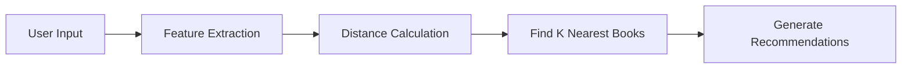
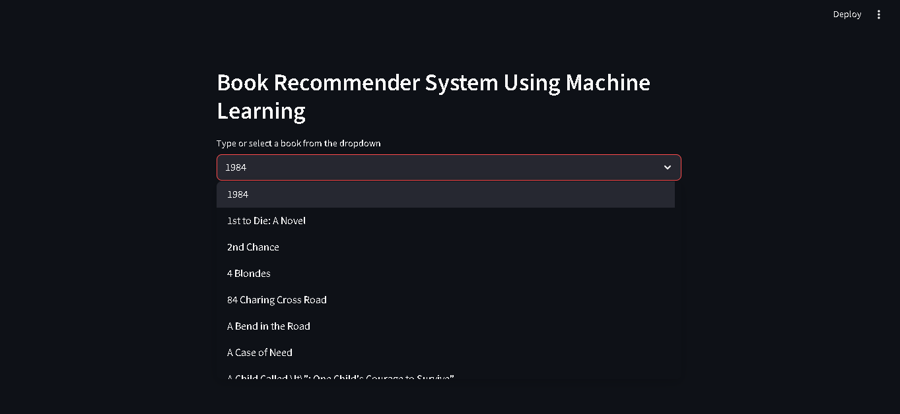
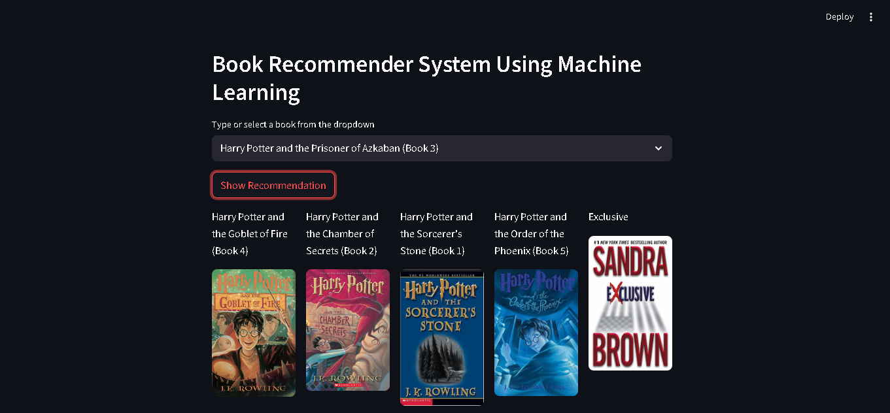

# 📚 AI-Powered Book Recommender System

<div align="center">


*Discover your next favorite book with the power of machine learning*

[Demo](#demo) • [Features](#features) • [Installation](#installation) • [Usage](#usage) • [Contributing](#contributing)

</div>

---

## 🎯 Overview

In today's fast-paced world, finding the perfect book can be overwhelming with millions of options available. Our **AI-Powered Book Recommender System** solves this problem by leveraging advanced machine learning algorithms to provide personalized book recommendations tailored to your unique reading preferences.

> **Why Recommendation Systems Matter?** They save cognitive resources by intelligently filtering through vast amounts of content to deliver precisely what you're looking for.

## ✨ Features

- 🤖 **Intelligent Recommendations** - Advanced ML algorithms analyze reading patterns
- 🎨 **Beautiful UI** - Clean, modern Streamlit interface
- ⚡ **Real-time Processing** - Instant recommendations based on your preferences
- 📊 **Collaborative Filtering** - Leverages community reading behavior
- 🔍 **Content-Based Filtering** - Analyzes book characteristics and attributes
- 🚀 **Scalable Architecture** - Built to handle growing datasets

## 🧠 How It Works

### Recommendation Approaches

| Type | Description | Use Case | Examples |
|------|-------------|----------|----------|
| **Content-Based** 📝 | Analyzes book features and attributes | Genre preferences, author similarity | *"If you like fantasy, try this..."* |
| **Collaborative** 👥 | Uses user behavior and ratings | Community-driven suggestions | *"Users like you also enjoyed..."* |
| **Hybrid** 🔄 | Combines both approaches | Best of both worlds | *Modern production systems* |

### Algorithm: K-Nearest Neighbors (KNN)



## 🚀 Quick Start

### Prerequisites

- Python 3.7+
- pip package manager
- Git

### Installation

1. **Clone the repository**
   ```bash
   git clone https://github.com/your-username/Books-Recommender-System-Using-Machine-Learning.git
   cd Books-Recommender-System-Using-Machine-Learning
   ```

2. **Create virtual environment**
   ```bash
   # Using conda
   conda create -n book-recommender python=3.7.10 -y
   conda activate book-recommender
   
   # Or using venv
   python -m venv book-recommender
   source book-recommender/bin/activate  # On Windows: book-recommender\Scripts\activate
   ```

3. **Install dependencies**
   ```bash
   pip install -r requirements.txt
   ```

4. **Generate ML models**
   ```bash
   jupyter notebook "Books Recommender.ipynb"
   ```

5. **Launch the application**
   ```bash
   streamlit run app.py
   ```

## 📱 Demo

## 📱 Demo

## 📱 Demo

### 🖥️ Book Selection Interface
<div align="center">
  
  <p><em>Clean dropdown interface to search and select books from the database</em></p>
</div>

### 📚 AI-Powered Recommendations
<div align="center">
  
  <p><em>Get personalized recommendations with book covers and detailed information - here showing Harry Potter series recommendations</em></p>
</div>

## 💻 Usage

1. Open your browser and navigate to `http://localhost:8501`
2. Enter your book preferences or select from available options
3. Get instant, personalized recommendations
4. Explore similar books based on your interests

## 📁 Project Structure

```
📦 Books-Recommender-System/
├── 📄 app.py                    # Main Streamlit application
├── 📓 Books Recommender.ipynb   # Model training notebook
├── 📋 requirements.txt          # Python dependencies
├── 🤖 model.pkl                 # Trained ML model (generated)
├── 📊 data/                     # Dataset directory
├── 📸 screenshots/              # Application screenshots
│   ├── homepage.png
│   ├── recommendations.png
│   └── search-filter.png
├── 📚 README.md                 # This file
└── 🔧 utils/                    # Utility functions
```

## 🛠 Tech Stack

<div align="center">

| Category | Technologies |
|----------|-------------|
| **Backend** |   |
| **Frontend** |  |
| **Data Processing** |   |
| **Development** |  |

</div>

## 📊 Dataset

The recommendation system is built using the comprehensive **Book Recommendation Dataset** from Kaggle:

- **Source**: [Book Recommendation Dataset](https://www.kaggle.com/ra4u12/bookrecommendation)
- **Size**: 1M+ book ratings
- **Features**: Book metadata, user ratings, reviews

## 🔮 Future Roadmap

- [ ] **Advanced Filtering** - Add more sophisticated search options
- [ ] **Real-time Learning** - Implement online learning algorithms
- [ ] **Review Analysis** - Integrate sentiment analysis of book reviews
- [ ] **User Profiles** - Add authentication and personalized dashboards
- [ ] **Mobile App** - Develop React Native companion app
- [ ] **Cloud Deployment** - Deploy on AWS/GCP for scalability
- [ ] **API Integration** - Connect with Goodreads and Google Books APIs

## 🤝 Contributing

We welcome contributions! Here's how you can help:

1. 🍴 Fork the repository
2. 🌿 Create a feature branch (`git checkout -b feature/amazing-feature`)
3. 💻 Make your changes
4. ✅ Run tests and ensure code quality
5. 📝 Commit your changes (`git commit -m 'Add amazing feature'`)
6. 🚀 Push to the branch (`git push origin feature/amazing-feature`)
7. 🎯 Open a Pull Request

## 📄 License

This project is licensed under the MIT License - see the [LICENSE](LICENSE) file for details.

## 🙏 Acknowledgments

- Thanks to the Kaggle community for providing the dataset
- Inspired by modern recommendation systems used by Netflix, Amazon, and Spotify
- Built with ❤️ by the open-source community

---

<div align="center">

**Built with ❤️ by [Fahd Ahmed Ali](https://www.linkedin.com/in/fahd-ahmed-9b6755307/)**

*Data & ML Engineer | Turning data into intelligent recommendations*

[](https://www.linkedin.com/in/fahd-ahmed-9b6755307/)
[](mailto:afahd9002@gmail.com)

</div>

---

<div align="center">
  <sub>⭐ If you found this project helpful, please give it a star!</sub>
</div>